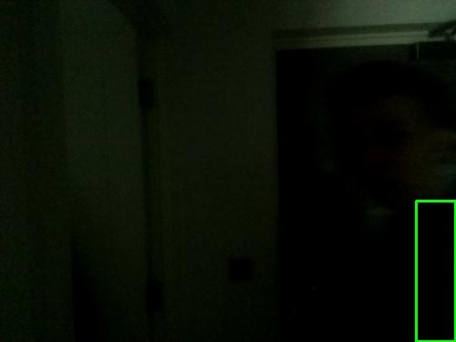

# MotionNotifier

Application that monitors the camera and detects whether geniuene motion has occured

## Install

`pip3 install -r requirements`

## Testing

`cd tests`
`python3 -m pytest`

## Logging

Logging to a file under user on linux

`/home/{user}/sync/MotionNotifier.log`

Im using this as Im using this folder to sync multiple devices